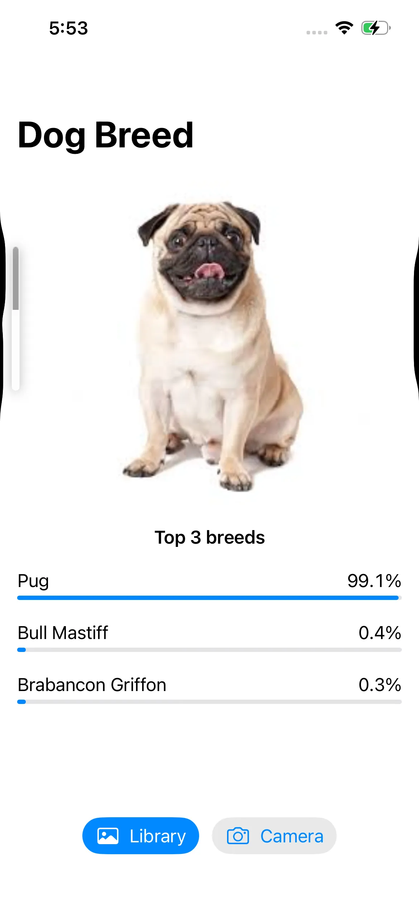
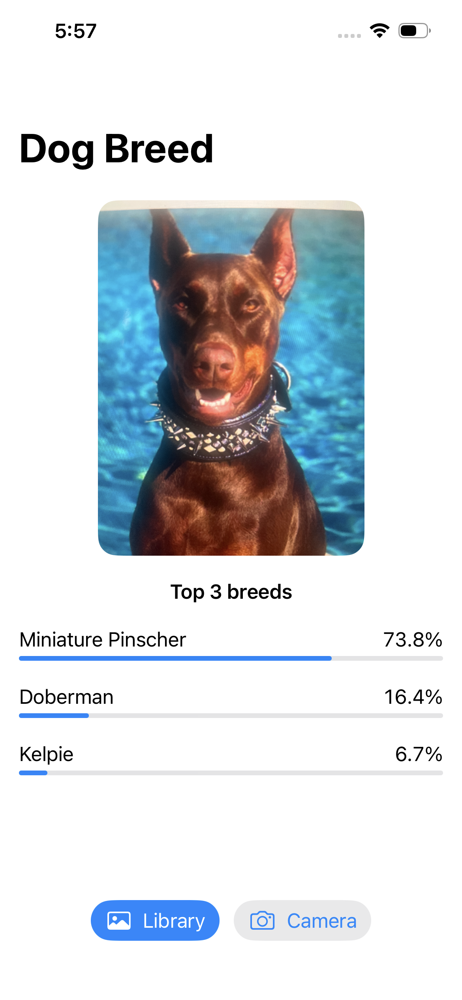
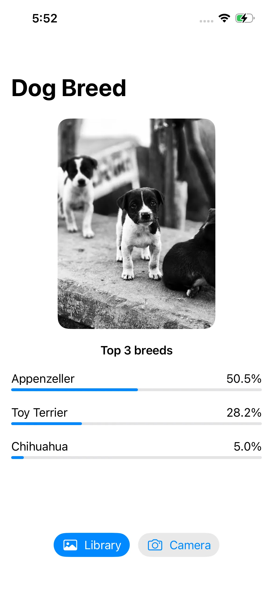
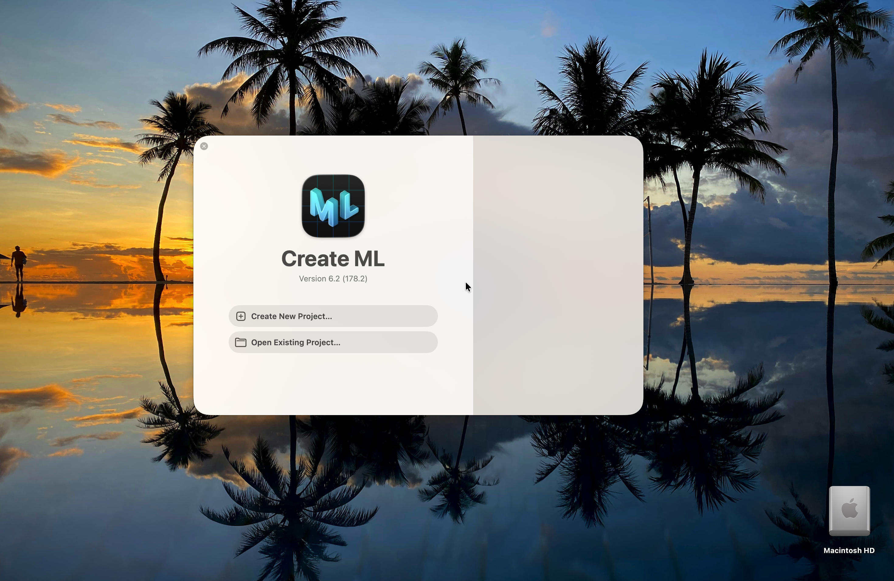
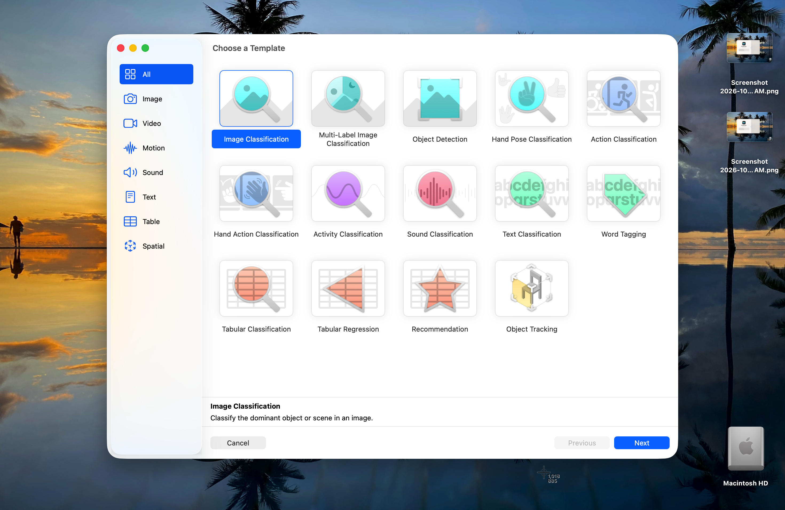
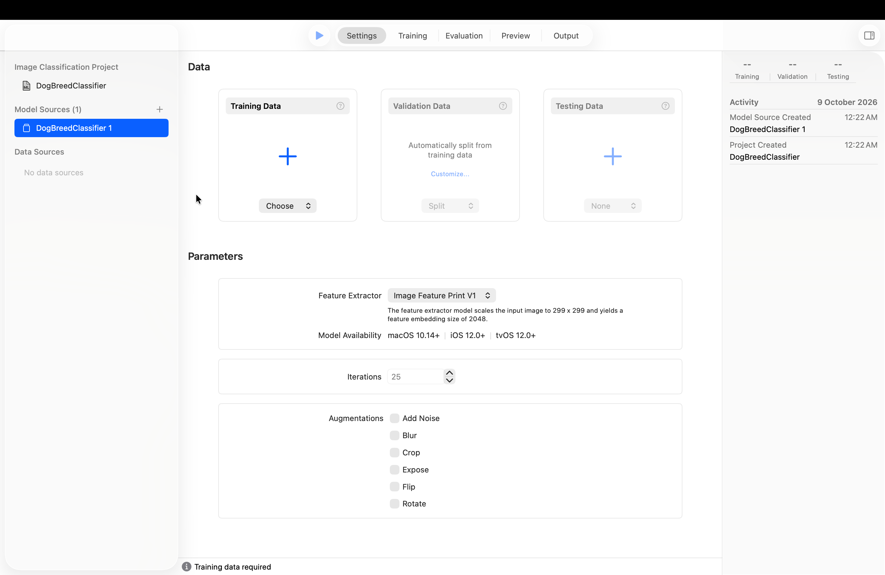
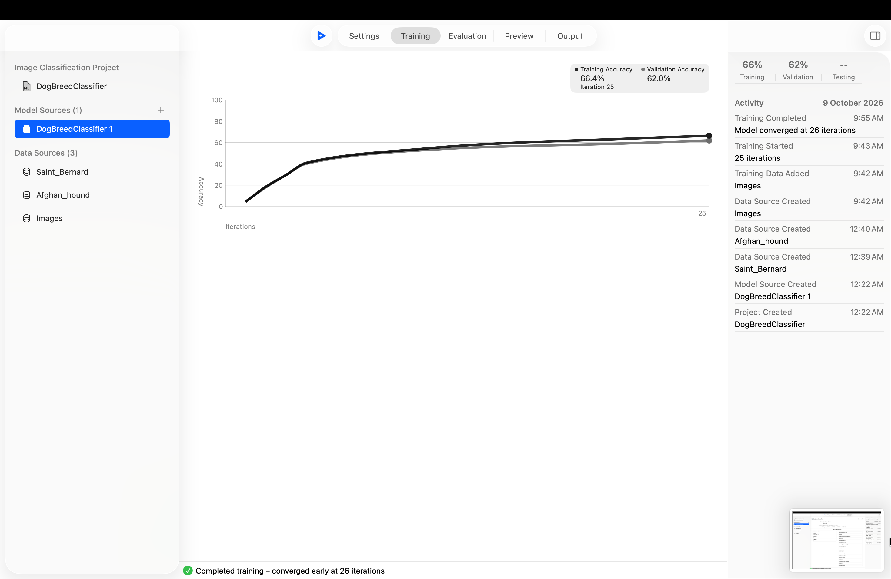
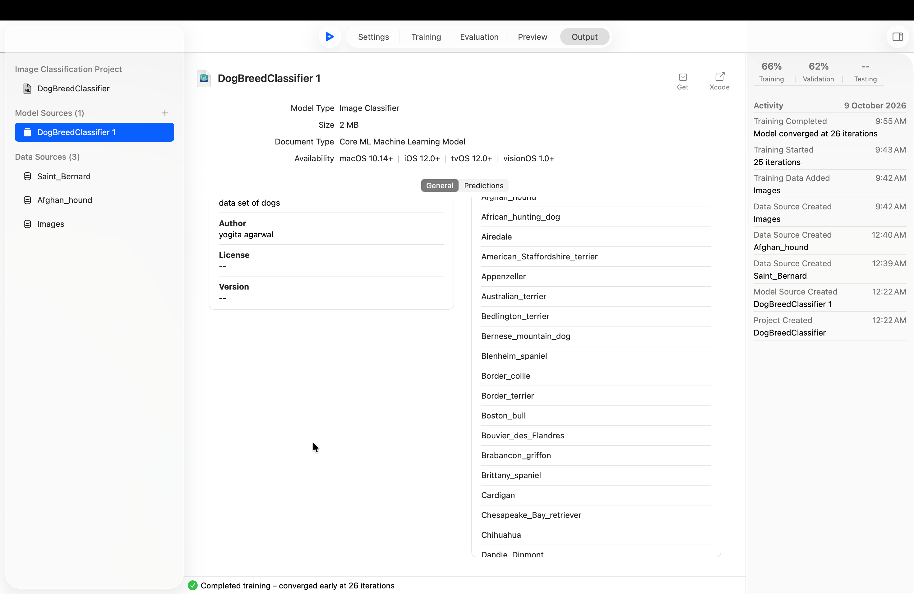
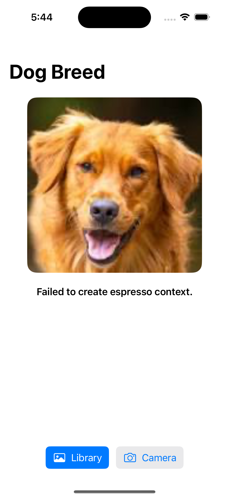

# 🐶 Dog Breed Classifier (iOS)

A SwiftUI iPhone app that identifies a dog's breed from a photo. It runs a model I trained myself with **Create ML** and does everything **on the device with Core ML**. There are no servers and no internet calls.

<p>
  
  
  
</p>

## Features

- Pick a photo from the **Library** or take one with the **Camera**
- Checks that the photo **contains a dog** before guessing a breed
- Shows the **top 3 breeds** with confidence bars
- Runs fully **offline**, on the device
- Runs ML work off the main thread, so the UI stays smooth

## Tech stack

| | |
| --- | --- |
| Language | Swift |
| UI | SwiftUI (`PhotosPicker`, `UIImagePickerController` for the camera) |
| ML training | Create ML (Image Classification template) |
| ML inference | Core ML + Vision (`VNCoreMLRequest`, `VNClassifyImageRequest`) |
| Architecture | MVVM (`@Observable` view model) |

## Dataset

**[Stanford Dogs Dataset](http://vision.stanford.edu/aditya86/ImageNetDogs/)**

- About **20,580 images** across **120 breeds**
- Built from ImageNet and labelled by breed
- Create ML expects one folder per breed, and the folder name becomes the label:

```
Images/
├── Afghan_hound/
├── Saint_Bernard/
├── pug/
└── ... (120 folders)
```

## Model

| Property | Value |
| --- | --- |
| File | `Models/DogBreedClassifier.mlmodel` |
| Type | Image Classifier (Core ML) |
| Size | ~2 MB |
| Classes | 120 dog breeds |
| Input | 299 × 299 colour image |
| Output | `target` (top breed) + `targetProbability` (all breeds) |
| Feature extractor | Apple Image Feature Print V1 (2048-number embedding) |
| Classifier | Logistic regression on top of the features |
| Iterations | 25 (converged early at 26) |
| Training accuracy | **66%** |
| Validation accuracy | **62%** |
| Availability | iOS 12+, macOS 10.14+ |

Create ML uses **transfer learning**. It doesn't train a full neural network from scratch. Apple's pre-built feature extractor turns each photo into features, and Create ML trains only a small classifier on top. That's why training took about 12 minutes on a Mac and the model is just 2 MB.

## Training with Create ML

**1. Open Create ML** (Xcode → Open Developer Tool → Create ML) and create a new project.



**2. Choose the Image Classification template.**



**3. Add the training data**, and set the iterations and augmentations (flip, crop, etc.). Leave validation on *Automatic* so Create ML holds back some images for testing.



**4. Train.** Training and validation accuracy stay close, so the model isn't overfitting.



**5. Export** the `.mlmodel` from the Output tab and add it to the Xcode project. Make sure Target Membership is ticked.



## How it works

```
Photo ──► Vision: "is there a dog?" ──no──► "No dog found"
                    │ yes
                    ▼
          Core ML: DogBreedClassifier ──► Top 3 breeds
```

1. **Dog check**: Vision's built-in `VNClassifyImageRequest` looks for a `dog` label with at least 30% confidence. This stops the app from guessing a breed for a cat or a chair.
2. **Breed check**: `VNCoreMLRequest` runs the Create ML model with a centre crop and returns the top 3 results.
3. **Orientation**: the photo's orientation is passed to Vision, so camera photos aren't classified sideways.

## Project structure

```
DogClassifier/
├── DogClassifier/
│   ├── DogClassifierApp.swift     # App entry point
│   └── ContentView.swift          # Main screen
├── Models/
│   ├── DogBreedClassifier.mlmodel # Trained Create ML model
│   └── Prediction.swift           # Breed + confidence
├── ViewModels/
│   └── ClassifierViewModel.swift  # Loads photos, runs classification
├── Services/
│   └── DogClassifier.swift        # Vision + Core ML logic
├── Views/
│   └── CameraPicker.swift         # Camera wrapper for SwiftUI
└── Screenshots/
```

## Results

| Photo | Top prediction | Correct? |
| --- | --- | --- |
| Pug | Pug — 99.1% | ✅ |
| Doberman | Miniature Pinscher — 73.8% (Doberman 2nd, 16.4%) | ❌ close |
| Indian (desi) puppies | Appenzeller — 50.5% | ❌ |

- **Pug**: a distinctive breed in a clean photo, so the model was nearly certain.
- **Doberman**: a Miniature Pinscher looks like a small Doberman, and a close-up photo gives no sense of size.
- **Indian puppies**: Indian dogs aren't in the Stanford dataset, so the model picked the closest-looking breed it knew. **A model can only recognise what it was trained on.**

## Known issue: Simulator



On the iOS Simulator, Core ML can fail with **"Failed to create espresso context."** Run the app on a **real iPhone** instead. The app shows a friendly message when this happens.

## Getting started

1. Clone the repo
   ```bash
   git clone https://github.com/theamazingyogita/DogClassifier.git
   ```
2. Open `DogClassifier.xcodeproj` in Xcode
3. Select your iPhone as the run destination and set your signing team
4. Build and run (⌘R)

## Future improvements

- Add more breeds, including **Indian dog breeds**
- Use more images per breed, more iterations and more augmentations to improve accuracy
- Try the newer feature extractor (Feature Print V2)
- Show "possibly a mixed breed" when confidence is low
- Add breed info cards (size, temperament, origin)

## Dataset credits

- [Stanford Dogs Dataset](http://vision.stanford.edu/aditya86/ImageNetDogs/): Aditya Khosla, Nityananda Jayadevaprakash, Bangpeng Yao and Li Fei-Fei

---

Made by [Yogita Agarwal](https://yogitaagarwalportfolio.vercel.app/) · [LinkedIn](https://www.linkedin.com/in/yogita-agarwal-artist1996/)
